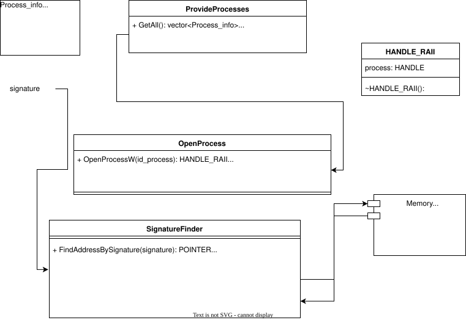

***SignatureFinder*** is a model that allows you to find the signature address and the address of the desired value using an offset within the required process.

---

### Technical implementation

To find the signature, we use auxiliary tools provided by the SignatureFinder module.

 -  **ProvideProcesses** 
    - First, we search for all running processes using ProvideProcesses. Under the hood, the main function used is CreateToolhelp32Snapshot ([Click](https://learn.microsoft.com/en-us/windows/win32/api/tlhelp32/nf-tlhelp32-createtoolhelp32snapshot)). All processes are iterated through and saved into a list of **ProcessInfo** structures, which stores the name of the process and its pId.
- **OpenProcess**
    - OpenProcess gives us access to the stream using the OpenProcess function ([Click](https://learn.microsoft.com/en-us/windows/win32/api/processthreadsapi/nf-processthreadsapi-openprocess)). You have the option to choose with what rights access will be opened, the OpenProcess class provides three possible methods for this(OpenProcessById**W**, OpenProcessById**R**, OpenProcessById**RW**). The result of the methods' work will be the Handler_raii structure, which does not oblige you to close access to the process yourself, but takes on this responsibility itself.
- **SignatureFinder**
    - The main function of this module. For proper operation, all necessary parameters, such as **handle_number of process**, **signature**, **non-const byte**, and **offset**, are passed through the constructor when creating a class instance. ```SignatureFinder(Handler_raii handler, const std::vector<uint8_t>& signature_, uint8_t NONCONST_BYTE_, size_t value_offset_)```. Inside the class there is a function **CheckForStableSignature** that checks the memory segment for the presence of the passed signature; if such memory is found, it returns the offset to the desired section where the signature itself is located.


